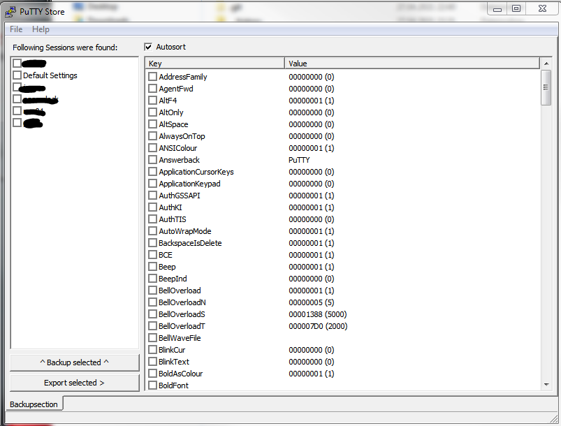

# PuTTY Store
Little helper tool for exporting partial PuTTY session data or backup complete session data.

1. [Quickstart](#Quickstart)
    1. [Backup](#Backup)
    2. [Export](#Export)
    3. [Restore](#Restore)
3. [Installation](#Installation)
4. [Building the software](#Building-the-software)
5. [Screenshots](#Screenshots)

## Quickstart 
### Backup
You can backup your entire PuTTY data.

1. In the left list, select the sessions which you want to back up
2. Hit the 'Backup selected' button, the first button under the 'backuplist'
3. Choose a filename and click save

Note: Try to use rightclick to get a Popup with multiple functions.

PuTTYstore will now read the data from the registry and write it into a textfile.
This file is stored with the filename you chose + the extension '.reg'

To reimport the data - just doubleclick on the '.reg'-file and it will be stored in 
your registry.

Note: When you doubleclick the '.reg'-file the inbuilt windows registry editor 
should write the data back to the registry.
PuTTYstore does not offer any reimport tools!

Attention: If you're not able to doubleclick the file, or nothing happens, then 
pleas go to:
'Start->Run' and enter 'regedit'. 
That will, hopefully, open the Windows Registry Editor. 
There you'll find an option for importing the PuTTYstore backup files.  

### Export
You can export partial information about your PuTTY sessions.

Click on the one of the PuTTY Sessions in the left list. (DO NOT CHECK IT!)

Then you will see detailed information in the right list.

You can then check all options you want to export.

Note: I tried to group several items into logical groups.
Use the rightlick menu to select or deselect groups of items.

Use the second button to 'export' the data.

Choose a filename and hit 'Save'. 
You will then get a '.reg' file which contains your data.

See the Quickstart topic 'Backup' on how to reimport the data.

### Restore
PuttyStore only writes out a *.reg File which you can import on the same pc or another pc by double clicking the file. The windows regedit.exe can also be used to restore the registry data.

## Installation
None - just run the single PuttyStore.exe file

## Building the software
To build the software yourself just open the project file in Turbo Delphi 2006 and recompile the project...

## Screenshot

